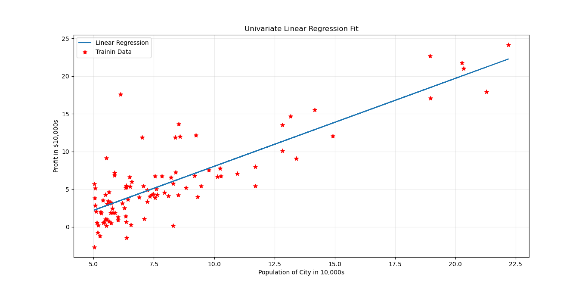
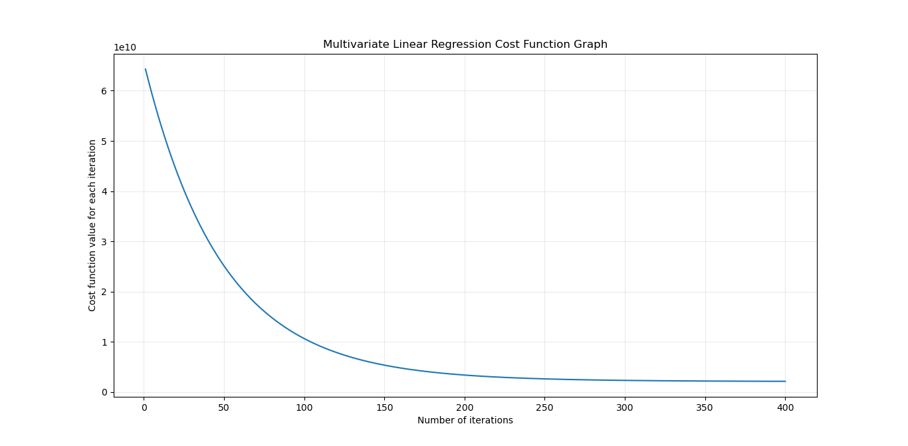

# Coding Linear Regression from Scratch Using Python
[Linear regression](https://en.wikipedia.org/wiki/Linear_regression) is a [supervised learning algorithm](https://en.wikipedia.org/wiki/Supervised_learning). It can be used to predict the continuous number output `y` based on the given input value of `x`. Here, I have tried to write this algorithm from scratch just using [Python](https://www.python.org/). For simplification, this problem is being divided into 3 parts: 

- [**Univariate Linear Regression**](https://github.com/Safayet-Khan/Machine-Learning-Algorithms-from-Scratch/blob/main/Linear%20Regression/univariate_linear_regression.py)
- [**Multivariate Linear Regression**](https://github.com/Safayet-Khan/Machine-Learning-Algorithms-from-Scratch/blob/main/Linear%20Regression/multivariate_linear_regression.py)
- [**Normal Equation in Linear Regression**](https://github.com/Safayet-Khan/Machine-Learning-Algorithms-from-Scratch/blob/main/Linear%20Regression/normal_equation_linear_regression.py)

## Visualization
- From [Univariate Linear Regression](https://github.com/Safayet-Khan/Machine-Learning-Algorithms-from-Scratch/blob/main/Linear%20Regression/univariate_linear_regression.py) script produces this linear regression model. 

  

- From [**Multivariate Linear Regression**](https://github.com/Safayet-Khan/Machine-Learning-Algorithms-from-Scratch/blob/main/Linear%20Regression/multivariate_linear_regression.py) script produces this cost function graph. 

  

## Acknowledgment
I have learned a lot regarding Machine Learning from the MOOC [“Machine Learning”](https://www.coursera.org/learn/machine-learning) on [Coursera](https://www.coursera.org/). It was taught by [Andrew Ng](https://en.wikipedia.org/wiki/Andrew_Ng). The class is based on [MATLAB](https://www.mathworks.com/products/matlab.html). I have tried my best to learn those algorithms from scratch and tried to write them in python.
