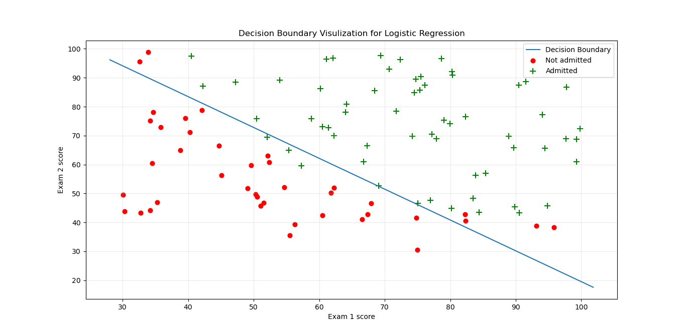
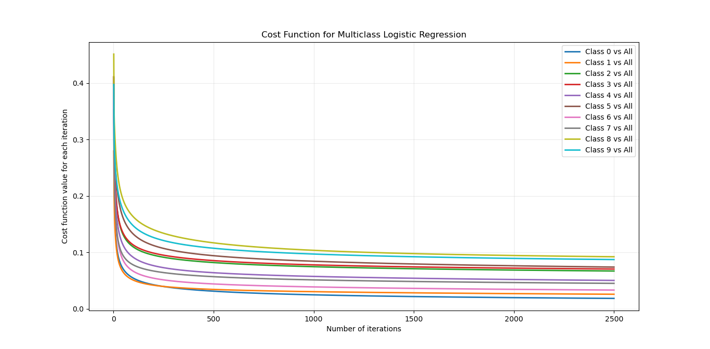
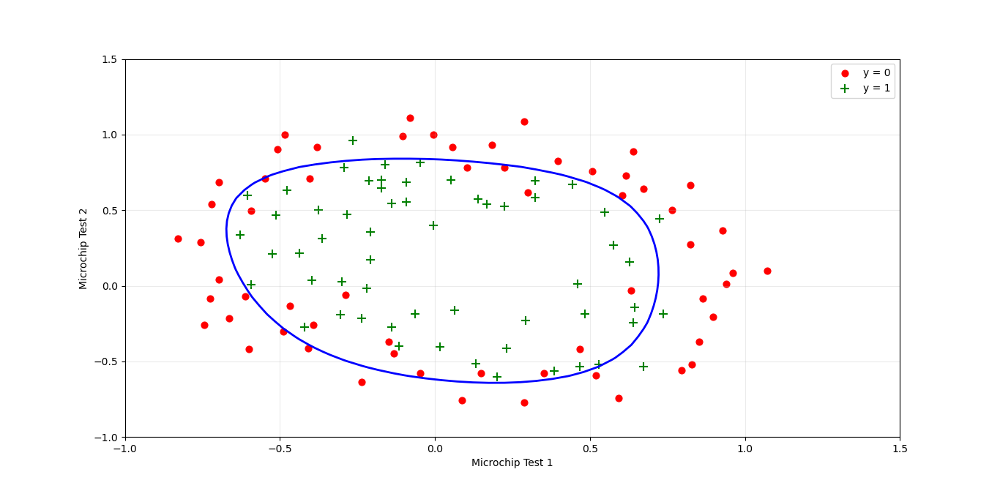

# Coding Logistic Regression from Scratch Using Python
[Logistic Regression](https://en.wikipedia.org/wiki/Logistic_regression) is a [supervised learning algorithm](https://en.wikipedia.org/wiki/Supervised_learning). It can be used to predict the discreate number output `y` based on the given input value of `x`. Here, I have tried to write this algorithm from scratch just using [Python](https://www.python.org/). For simplification, this problem is being divided into 3 parts: 

- [**Logistic Regression Binary Classification**](https://github.com/Safayet-Khan/Machine-Learning-Algorithms-from-Scratch/blob/main/Logistic%20Regression/logistic_regression_binary_classification.py)
- [**Logistic Regression Multiclass Classification**](https://github.com/Safayet-Khan/Machine-Learning-Algorithms-from-Scratch/blob/main/Logistic%20Regression/logistic_regression_multiclass_classification.py)
- [**Logistics Regression with Regularization**](https://github.com/Safayet-Khan/Machine-Learning-Algorithms-from-Scratch/blob/main/Logistic%20Regression/logistics_regression_with_regularization.py)

## Visualization
- From [logistic_regression_binary_classification.py](https://github.com/Safayet-Khan/Machine-Learning-Algorithms-from-Scratch/blob/main/Logistic%20Regression/logistic_regression_binary_classification.py) script produces this logistic regression decision boundary. 

  

- From [logistic_regression_multiclass_classification.py](https://github.com/Safayet-Khan/Machine-Learning-Algorithms-from-Scratch/blob/main/Logistic%20Regression/logistic_regression_multiclass_classification.py) script produces this cost function graph. 

  

- From [logistics_regression_with_regularization.py](https://github.com/Safayet-Khan/Machine-Learning-Algorithms-from-Scratch/blob/main/Logistic%20Regression/logistics_regression_with_regularization.py) script produces this logistic regression decision boundary.

  

## Acknowledgment
I have learned a lot regarding Machine Learning from the MOOC [“Machine Learning”](https://www.coursera.org/learn/machine-learning) on [Coursera](https://www.coursera.org/). It was taught by [Andrew Ng](https://en.wikipedia.org/wiki/Andrew_Ng). The class is based on [MATLAB](https://www.mathworks.com/products/matlab.html). I have tried my best to learn those algorithms from scratch and tried to write them in python.

